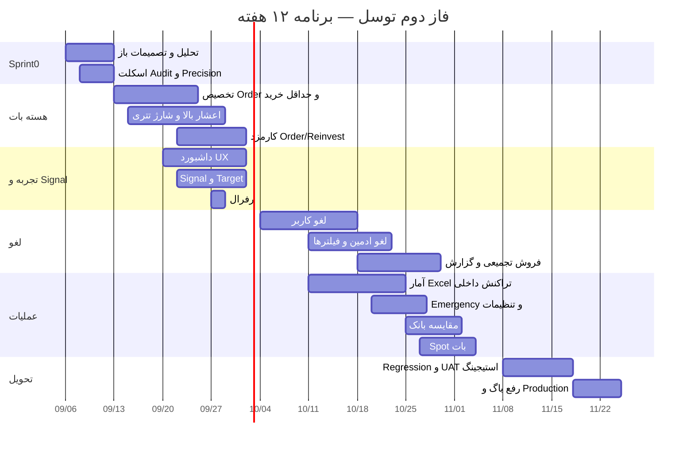

# مشخصات نیازمندی نرم‌افزار (SRS)
## سیستم توسل — فاز دوم توسعه و اصلاحات

| فیلد | مقدار |
| --- | --- |
| محصول | سیستم توسل در پلتفرم بیتکس‌روم |
| نوع سند | Software Requirements Specification (SRS) + زمان‌بندی و نفرساعت |
| نسخه | 1.0 |
| تاریخ | ۱۴۰۴/۰۶/۱۳ — 2026-09-04 |
| منبع بالادستی | RFP فاز دوم توسعه و اصلاح سیستم توسل، نسخه 1.0 |
| وضعیت | مبنای برآورد، برنامه‌ریزی و اجرا |
| دامنه اصلی | فاز دوم بات توسل (منطق سفارش، سیگنال، لغو، کارمزد، گزارش، کنترل اضطراری) |

---

## ۱. مقدمه

### ۱.۱ هدف سند

این سند نیازمندی‌های فاز دوم سیستم توسل را از RFP به قالب قابل اجرا برای تیم محصول، توسعه و QA تبدیل می‌کند. برای هر قابلیت:

- نیازمندی کارکردی با شناسه پایدار
- یوزراستوری و معیار پذیرش
- وابستگی و اولویت
- برآورد نفرساعت (Backend / Frontend / QA)

خروجی این سند باید برای برآورد پیمانکار، شکست کار (WBS)، زمان‌بندی Milestone و معیار تحویل فاز دوم قابل استناد باشد.

### ۱.۲ دامنه محصول

توسل یک زیرسیستم معامله‌گری سیگنال‌محور روی پلتفرم بیتکس‌روم است. کاربر سرمایه را به توسل تخصیص می‌دهد؛ سیستم بر اساس Signal / Target / Order خرید و فروش می‌کند؛ Reinvest، کارمزد، رفرال و گزارش مالی بخشی از همین جریان هستند.

فاز دوم روی **بات توسل** متمرکز است: انعطاف Order، شفافیت داشبورد، اصلاح Signal/Target، لغو توسط کاربر و ادمین، کارمزدها، گزارش‌ها، کنترل اضطراری، Precision ارزها، و رفع باگ‌های Spot مرتبط با بات.

فاز اول (زیرساخت فعلی بات، پنل کاربر/ادمین، اتصال صرافی مرجع، واریز/برداشت پایه) موجود فرض می‌شود.

### ۱.۳ مخاطبان

| نقش | استفاده از سند |
| --- | --- |
| محصول / مالی | تصمیم‌های باز، فرمول سود، مدل کارمزد، پذیرش تحویل |
| تیم IT / Backend | منطق سفارش، Precision، لغو، تسویه، Audit، API صرافی |
| Frontend کاربر / ادمین / بات | داشبورد، تأیید لغو، گزارش، تنظیمات |
| QA | سناریو پذیرش، Regression، موارد مرزی |
| پیمانکار | نفرساعت، Milestone، پیش‌نیاز، ریسک |

### ۱.۴ تعاریف و اختصارات

| اصطلاح | تعریف |
| --- | --- |
| توسل | زیرسیستم معامله‌گری سیگنال‌محور بیتکس‌روم |
| Signal | تعریف فرصت خرید یک ارز در محدوده قیمتی مشخص |
| Target | اهداف فروش تعریف‌شده روی هر Signal (Target 1/2/3) |
| Order / Position | سفارش یا موقعیت ایجادشده از تخصیص سرمایه به یک Signal |
| Reinvest | سرمایه‌گذاری مجدد سود در چرخه بعدی خرید |
| Threshold | حداقل درصد سود لازم برای مجاز بودن لغو |
| Preview | حالت نمایشی/غیرفعال که نباید با خرید واقعی اشتباه شود |
| صرافی مرجع | صرافی خارجی که خرید/فروش واقعی روی آن اجرا می‌شود |
| ارزش تتری | ارزش معادل موجودی یا شارژ بر حسب USDT |
| Precision | تعداد اعشار مجاز مقدار ارز طبق محدودیت صرافی و سیستم |
| Audit Log | ردپای قابل پیگیری عملیات حساس |
| Emergency Control | کلید اضطراری توقف کل توسل یا یک/چند ارز |
| KPI | شاخص عملکرد عملیاتی و مالی توسل |
| Regression | تست عدم شکست قابلیت‌های فعلی پس از تغییر |

### ۱.۵ منابع

1. سند RFP فاز دوم توسعه و اصلاح سیستم توسل، نسخه 1.0
2. رفتار فعلی سیستم توسل در Production (فاز اول)
3. محدودیت‌های API صرافی مرجع (حداقل خرید/فروش، Precision، Market)
4. پنل ادمین و API موجود پلتفرم بیتکس‌روم (`api-service`, `admin-panel`)

### ۱.۶ فرض‌های برآورد نفرساعت

| فرض | مقدار |
| --- | --- |
| یک نفرروز | ۸ نفرساعت |
| ترکیب تیم پیشنهادی | ۲ Backend + ۱ Frontend + ۱ QA (نیمه‌وقت در ۴ هفته اول) |
| شمول برآورد هر آیتم | تحلیل ریز، پیاده‌سازی، تست واحد، بازبینی کد، تست پذیرش همان آیتم |
| عدم شمول | انتظار تصمیم محصول، خرابی Production، مهاجرت کامل صرافی (فاز ۳) |
| بافر یکپارچه‌سازی و ناشناخته | ۱۵٪ روی مجموع خام |
| نرخ موازی‌سازی | کارهای داشبورد/سیگنال/کپی رفرال موازی با منطق Order قابل اجراست |
| مسیر بحرانی | لغو کاربر + لغو ادمین + فروش تجمیعی زیر حداقل مبلغ |

---

## ۲. توصیف کلی سیستم

### ۲.۱ چشم‌انداز فاز دوم

فاز دوم باید تجربه کاربر را شفاف کند، تعریف Signal/Order را منعطف کند، پنل کاربر و ادمین را کامل کند، مدیریت سرمایه/سفارش/ربات را بهبود دهد، گزارش مالی بدهد، باگ‌های فعلی را ببندد، سازوکار لغو و کارمزد بسازد، و زیرساخت فازهای بعدی را بدون شکستن قابلیت‌های فعلی آماده کند.

### ۲.۲ کاربران

| بازیگر | هدف اصلی در فاز دوم |
| --- | --- |
| کاربر توسل | دیدن موجودی و عملکرد، تخصیص سرمایه، فعال شدن خودکار، لغو جزئی سفارش‌های سودده |
| ادمین عملیات | مدیریت Signal/Target، فیلتر ربات/Reinvest، لغو گروهی، کنترل اضطراری |
| ادمین مالی | کارمزدها، حداقل برداشت، مقایسه با بانک، خروجی Excel، KPI |
| سیستم / جاب | اجرای خرید/فروش، کسر کارمزد Order/Reinvest، ثبت تراکنش داخلی و Audit |
| صرافی مرجع | حداقل مقدار، Precision، قیمت Market، کارمزد شبکه و معامله |

### ۲.۳ مرز سیستم

**داخل دامنه فاز دوم**

1. منطق خرید و مدیریت Order
2. داشبورد و تجربه کاربری توسل
3. Signal و Target
4. گزارش‌ها و پنل ادمین
5. لغو معاملات توسط کاربر و ادمین
6. مدیریت کارمزدها
7. مدیریت ربات و Reinvest
8. تراکنش‌های داخلی و گزارش‌گیری
9. کنترل‌های اضطراری
10. مقایسه سود کاربر با سود بانک
11. اصلاحات بخش Spot مرتبط با بات
12. ارزهای با اعشار بالا و ارزهای بدون شبکه

**خارج از دامنه (فاز سوم مگر با تصمیم محصول)**

- لغو تک‌تک Orderها با جریان کامل جداگانه، اگر پیچیدگی از حد فاز ۲ بالاتر باشد
- مهاجرت کامل به صرافی جدید
- انتقال دارایی به‌صورت مستقیم یا تبدیل به USDT در سناریوی مهاجرت
- الگوریتم کامل فروش تجمیعی زیرحداقل، اگر محدودیت API طراحی جدا بخواهد
- هر موردی که در تحلیل فنی نیازمند طراحی جدا تشخیص داده شود

### ۲.۴ قیود فنی

- تغییرات نباید قابلیت‌های فعلی را مختل کنند.
- همه قابلیت‌ها ابتدا در Test/Staging تست می‌شوند.
- Regression برای خرید، فروش، Signal، Order، موجودی، کارمزد، واریز/برداشت، Reinvest و Spot الزامی است.
- خطاها باید پیام واضح فارسی داشته باشند.
- عملیات حساس باید Log و Audit Trail داشته باشند.
- شکست API، فروش یا انتقال نباید تراکنش ناقص باقی بگذارد؛ وضعیت باید قابل پیگیری باشد.
- Precision و تعداد اعشار ارز در تمام محاسبات حفظ شود.
- انتشار Production فقط پس از تأیید محصول/IT.

### ۲.۵ وابستگی‌های محصول / IT قبل از توسعه کامل

این ۱۳ تصمیم باید قبل یا حداکثر در هفته اول Sprint 0 بسته شوند؛ در غیر این صورت بافر و تاریخ تحویل جابه‌جا می‌شود.

| # | تصمیم | اثر روی برآورد |
| --- | --- | --- |
| D1 | فرمول دقیق سود هنگام لغو | مسیر بحرانی لغو کاربر/ادمین |
| D2 | فرمول مقایسه سود کاربر با بانک | ماژول مقایسه بانک |
| D3 | نحوه لحاظ سود Referral در مقایسه بانک | ماژول مقایسه بانک |
| D4 | روش فروش و تسویه Orderهای زیر حداقل فروش | بالاترین ریسک فنی |
| D5 | نحوه تقسیم فروش تجمیعی بین کاربران | بالاترین ریسک فنی |
| D6 | رفتار سیستم در تغییر قیمت یا شکست API هنگام لغو | Idempotency و وضعیت سفارش |
| D7 | نحوه انتقال دارایی در مهاجرت به صرافی جدید | عمدتاً فاز ۳؛ حالت «فقط بستن» در فاز ۲ می‌ماند |
| D8 | فاز اجرای لغو جزئی Orderها | اگر به فاز ۳ برود، حدود ۴۸h از فاز ۲ کم می‌شود |
| D9 | نمایش اطلاعات محرمانه در گزارش کاربر | گزارش لغو |
| D10 | مدل نهایی کارمزد Order/Reinvest و ارتباط با کارمزدهای فعلی | منطق خرید |
| D11 | روش دقیق تعیین ارزش تتری برای شارژ اعشار بالا | شارژ موجودی |
| D12 | مدیریت Precision طبق محدودیت صرافی و API | همه مسیرهای مالی |
| D13 | ثبت افزایش موجودی ارز بدون شبکه و نوع تراکنش | تراکنش داخلی / Audit |

---

## ۳. معماری منطقی (سطح نیازمندی)

چهار لایه تحت تأثیر فاز دوم:

```text
[پنل کاربر توسل] [ربات تلگرام] [سایت بیتکس‌روم / کریپتونگار]
                 |
                 v
        [API توسل / api-service]
                 |
     +-----------+-----------+
     |           |           |
[موتور Order] [موتور لغو] [کارمزد / Reinvest]
     |           |           |
     +-----------+-----------+
                 |
        [کیف پول / موجودی / Precision]
                 |
        [صرافی مرجع + Spot Matching]
                 |
        [Audit Log + گزارش + Excel]
```

ماژول‌های جدید یا گسترش‌یافته:

| ماژول | مسئولیت فاز دوم |
| --- | --- |
| Allocation Engine | تخصیص درصد/مبلغ ثابت به هر Order، رعایت حداقل خرید و سقف موجودی |
| Precision Service | اعشار هر ارز، جلوگیری از گرد شدن مخرب، سازگاری با صرافی |
| Fee Engine | کارمزد برداشت توسل، Order/Reinvest، کارمزد لغو، سهم سود مجموعه |
| Cancel Engine | واجدشرایط بودن، لغو جزئی کاربر، لغو گروهی ادمین، دو حالت بستن/تبدیل |
| Settlement Engine | فروش Market، تجمیع زیر حداقل، تخصیص سهم کاربر |
| Emergency Control | توقف کل / یک ارز / چند ارز |
| Reporting | KPI ادمین، Excel، گزارش پیش/پس لغو |
| Audit Trail | ردپای عملیات حساس و تغییرات موجودی/تنظیمات/ربات |
| Bank Compare | سود روزانه کاربر (± رفرال) نسبت به سود بانک |

---

## ۴. نیازمندی‌های کارکردی، یوزراستوری و نفرساعت

اولویت‌ها: **Must** = تحویل فاز ۲ الزامی است. **Should** = باید بیاید مگر تصمیم محصول خلاف آن باشد.

ساعت‌ها: Backend | Frontend (کاربر + ادمین + بات/وب) | QA

### ۴.۱ منطق خرید و Order

#### FR-ORD-01 — تخصیص مستقل هر Order

**اولویت:** Must | **پیچیدگی:** متوسط | **RFP:** 3.1

**شرح:** برای هر Order بتوان مستقل مبلغ ثابت یا درصد تخصیص داد. ترکیب درصد و مبلغ در یک سبد مجاز است.

**یوزراستوری**

- به‌عنوان ادمین/سیستم تخصیص، می‌خواهم برای Order اول ۵٪، Order دوم ۱۰ دلار و Order سوم ۱۵ دلار تعریف کنم تا سرمایه کاربر منعطف تقسیم شود.
- به‌عنوان کاربر، می‌خواهم ببینم هر Order با چه سهمی ساخته شده است.

**معیار پذیرش**

- هر Order فیلد تخصیص مستقل از نوع `percent` یا `fixed_usdt` دارد.
- مجموع تخصیص از موجودی قابل‌استفاده بیشتر نمی‌شود؛ در غیر این صورت خطای واضح.
- مثال RFP قابل اجرا و تست است.
- مقدار ذخیره‌شده در سفارش با مقدار نمایش‌داده‌شده یکی است.

| BE | FE | QA | جمع |
| ---: | ---: | ---: | ---: |
| ۱۲ | ۸ | ۶ | **۲۶** |

#### FR-ORD-02 — حداقل مبلغ خرید صرافی

**اولویت:** Must | **پیچیدگی:** بالا | **RFP:** 3.2

**شرح:** اگر تخصیص درصدی از حداقل خرید صرافی کمتر باشد و موجودی کافی باشد، سیستم حداقل مجاز را می‌خرد. هرگز بیش از موجودی قابل‌استفاده سفارش ثبت نمی‌شود.

**یوزراستوری**

- به‌عنوان سیستم خرید، اگر تخصیص ۲.۵ دلار و حداقل خرید ۵ دلار باشد و موجودی کافی باشد، ۵ دلار می‌خرم.
- به‌عنوان کاربر، نمی‌خواهم به‌خاطر حداقل صرافی موجودی‌ام منفی یا قفل نامعتبر شود.

**معیار پذیرش**

- قانون: `allocated < min_buy` و `available >= min_buy` → خرید `min_buy`.
- اگر `available < min_buy` → خرید انجام نشود، وضعیت و دلیل ثبت شود.
- این منطق باعث سفارش بزرگ‌تر از موجودی نمی‌شود.
- حداقل خرید از صرافی مرجع خوانده/همگام می‌شود نه مقدار سخت‌کد.

| BE | FE | QA | جمع |
| ---: | ---: | ---: | ---: |
| ۱۴ | ۲ | ۱۰ | **۲۶** |

#### FR-ORD-03 — ارزهای با تعداد اعشار بالا

**اولویت:** Must | **پیچیدگی:** بالا | **RFP:** 3.3 (تعهد فاز قبل)

**شرح:** افزودن و مدیریت ارزهایی با اعشار بالا. مقدار در خرید، فروش، موجودی، نمایش و تراکنش با دقت مناسب حفظ شود.

**یوزراستوری**

- به‌عنوان ادمین، می‌خواهم ارز با اعشار بالا اضافه کنم بدون اینکه موجودی کاربران صفر یا غلط شود.
- به‌عنوان سیستم، می‌خواهم با Precision صرافی سازگار باشم.

**معیار پذیرش**

- اعشار هر ارز قابل پیکربندی و در محاسبه/ذخیره/نمایش یکسان است.
- گرد شدن نامناسب یا حذف مقدار خرد رخ نمی‌دهد.
- محدودیت Precision صرافی در سفارش‌گذاری رعایت می‌شود.
- تست روی حداقل یک ارز اعشار بالا (مثلاً ADA و یک ارز خردتر) پاس می‌شود.

| BE | FE | QA | جمع |
| ---: | ---: | ---: | ---: |
| ۲۰ | ۱۰ | ۱۲ | **۴۲** |

#### FR-ORD-04 — شارژ بر اساس ارزش تتری

**اولویت:** Must | **پیچیدگی:** متوسط-بالا | **RFP:** 3.4

**شرح:** برای ارزهایی که محدودیت تعداد واحد، شارژ را سخت می‌کند، افزایش موجودی بر اساس ارزش معادل USDT انجام شود.

**یوزراستوری**

- به‌عنوان ادمین، می‌خواهم به‌جای تعداد واحد، معادل ۵۰ USDT از ارز X را به کاربر شارژ کنم.
- به‌عنوان کاربر، می‌خواهم هم مقدار ارز و هم معادل تتری را ببینم.

**معیار پذیرش**

- ورودی شارژ می‌تواند USDT باشد؛ مقدار ارز از نرخ تبدیل محاسبه می‌شود.
- مقدار ارز و معادل USDT همزمان نمایش داده می‌شود.
- حداقل/حداکثر صرافی رعایت می‌شود.
- موجودی بیش از مقدار مجاز ایجاد نمی‌شود.
- نرخ تبدیل، زمان نرخ و نتیجه در Log ثبت می‌شود.

| BE | FE | QA | جمع |
| ---: | ---: | ---: | ---: |
| ۱۲ | ۱۰ | ۸ | **۳۰** |

#### FR-ORD-05 — افزایش موجودی ارز بدون شبکه

**اولویت:** Must | **پیچیدگی:** متوسط | **RFP:** 3.5

**شرح:** افزایش موجودی ارزهایی که Network مستقل انتقال ندارند، بدون اجبار به آدرس واریز/برداشت.

**یوزراستوری**

- به‌عنوان ادمین، می‌خواهم موجودی کاربر در ارز بدون شبکه را به‌صورت تراکنش داخلی افزایش دهم.
- به‌عنوان حسابرسی، می‌خواهم منبع و نوع این افزایش مشخص باشد.

**معیار پذیرش**

- افزایش موجودی بدون Network/آدرس اجباری ممکن است.
- نوع تراکنش: داخلی/سیستمی، متمایز از واریز بلاکچینی.
- منبع، مبلغ، ارز، کاربر، مجری در Audit هست.
- موجودی جدید در پنل کاربر و ادمین درست است.

| BE | FE | QA | جمع |
| ---: | ---: | ---: | ---: |
| ۱۲ | ۱۰ | ۸ | **۳۰** |

**جمع بسته Order / Precision:** ۱۵۴ نفرساعت

---

### ۴.۲ داشبورد و تجربه کاربری

#### FR-UX-01 — موجودی کل، درگیر توسل، آزاد

**اولویت:** Must | **RFP:** 4.1

**یوزراستوری:** به‌عنوان کاربر، در داشبورد می‌خواهم کل موجودی، موجودی درگیر توسل و موجودی آزاد را جدا ببینم تا بدانم چقدر قابل برداشت/تخصیص است.

**معیار پذیرش:** سه عدد همیشه با هم سازگارند (`کل = درگیر + آزاد` مگر تعریف محصول خلاف آن را مکتوب کند). به‌روز بودن پس از خرید، فروش، لغو و انتقال داخلی.

| BE | FE | QA | جمع |
| ---: | ---: | ---: | ---: |
| ۸ | ۸ | ۴ | **۲۰** |

#### FR-UX-02 — آمار عملکرد ۲۴ساعته و روزانه

**اولویت:** Must | **RFP:** 4.2

**یوزراستوری:** به‌عنوان کاربر، تعداد و حجم خرید/فروش توسل را برای ۲۴ ساعت گذشته و به‌صورت روزانه می‌بینم.

**معیار پذیرش:** چهار سنجه: تعداد خرید، تعداد فروش، حجم خرید، حجم فروش. بازه ۲۴ساعته و روزانه مشخص و مستند است (تقویم سیستم / تهران).

| BE | FE | QA | جمع |
| ---: | ---: | ---: | ---: |
| ۱۰ | ۱۰ | ۶ | **۲۶** |

#### FR-UX-03 — دسترسی مجدد به آموزش و قوانین

**اولویت:** Should | **RFP:** 4.3

**یوزراستوری:** پس از ورود به توسل، هنوز از داخل پنل به آموزش اولیه و قوانین دسترسی دارم.

**معیار پذیرش:** لینک/صفحه آموزش و قوانین بعد از Start مخفی نمی‌شود.

| BE | FE | QA | جمع |
| ---: | ---: | ---: | ---: |
| ۲ | ۶ | ۲ | **۱۰** |

#### FR-UX-04 — حذف یا اصلاح Preview

**اولویت:** Must | **RFP:** 4.4

**یوزراستوری:** به‌عنوان کاربر تازه‌وارد، نباید تصور کنم سیستم فعال است یا خرید واقعی انجام شده، در حالی که Preview یا غیرفعال است.

**معیار پذیرش:** اگر Preview حذف شود، هیچ مسیر UI آن را نشان نمی‌دهد. اگر بماند، برچسب غیرفعال بودن واضح است و با وضعیت واقعی خرید یکی است.

| BE | FE | QA | جمع |
| ---: | ---: | ---: | ---: |
| ۸ | ۸ | ۶ | **۲۲** |

#### FR-UX-05 — فعال‌سازی خودکار

**اولویت:** Must | **RFP:** 4.5

**یوزراستوری:** بعد از افزایش موجودی، اگر شرایط لازم برقرار باشد، توسل خودکار فعال شود و وضعیت واضح به من نشان داده شود.

**معیار پذیرش:** شرایط فعال‌سازی (حداقل موجودی، عدم Emergency، تکمیل آموزش در صورت الزام محصول) مستند است. اگر شرط برقرار نباشد، دلیل نمایش داده می‌شود. وضعیت جدید در پنل و Audit ثبت می‌شود.

| BE | FE | QA | جمع |
| ---: | ---: | ---: | ---: |
| ۱۰ | ۶ | ۸ | **۲۴** |

**جمع بسته UX:** ۱۰۲ نفرساعت

---

### ۴.۳ Signal و Target

#### FR-SIG-01 — نمایش خرید همان Signal

**اولویت:** Must | **RFP:** 5.1

تعداد و ارزش خرید در پنل کاربر فقط مربوط به همان Signal است؛ مجموع Signalهای دیگر داخلش نیاید.

| BE | FE | QA | جمع |
| ---: | ---: | ---: | ---: |
| ۸ | ۶ | ۴ | **۱۸** |

#### FR-SIG-02 — اعتبارسنجی Sell Order

**اولویت:** Must | **RFP:** 5.2

قانون: اگر قیمت Sell Order کمتر یا مساوی سقف محدوده خرید باشد، تعریف Signal مجاز نیست و خطای مناسب نمایش داده شود.

```text
Sell Order ≤ Maximum Buy Range  →  Error
```

| BE | FE | QA | جمع |
| ---: | ---: | ---: | ---: |
| ۶ | ۴ | ۴ | **۱۴** |

#### FR-SIG-03 — نمایش Target اول فروش

**اولویت:** Should | **RFP:** 5.3

در لیست Signal پنل ادمین، Target اول فروش بلافاصله پس از گزینه سقف قیمت نمایش داده شود.

| BE | FE | QA | جمع |
| ---: | ---: | ---: | ---: |
| ۴ | ۴ | ۲ | **۱۰** |

#### FR-SIG-04 — اصلاح Quick Edit

**اولویت:** Must | **RFP:** 5.4

Quick Edit باید Targetهای تعریف‌شده را برای همه ارزها از جمله ADA نشان دهد.

| BE | FE | QA | جمع |
| ---: | ---: | ---: | ---: |
| ۶ | ۶ | ۶ | **۱۸** |

#### FR-SIG-05 — رنگ‌بندی وضعیت Signal

**اولویت:** Must | **RFP:** 5.5

کل سطر Signal بر اساس قیمت فعلی نسبت به محدوده خرید رنگ شود. بالای صفحه جمع تعداد سیگنال سبز / زرد / قرمز نمایش داده شود.

| وضعیت | رنگ |
| --- | --- |
| داخل محدوده خرید | سبز |
| بالاتر از محدوده خرید | زرد |
| پایین‌تر از محدوده خرید | قرمز |

| BE | FE | QA | جمع |
| ---: | ---: | ---: | ---: |
| ۶ | ۱۰ | ۴ | **۲۰** |

**جمع بسته Signal/Target:** ۸۰ نفرساعت

---

### ۴.۴ رفرال و محتوای کاربر

#### FR-REF-01 — متن رفرال

**اولویت:** Should | **RFP:** 6.1

متن قبل و هنگام Start:

> که توسل سیستم سود بسازه، بفرست برای دوستات و درآمد دائمی داشته باش. هر بار **۸٪** از سود مجموعه، برات واریز می‌شه.

عبارت‌های مشخص‌شده در صورت امکان Bold شوند.

| BE | FE | QA | جمع |
| ---: | ---: | ---: | ---: |
| ۱ | ۳ | ۱ | **۵** |

#### FR-REF-02 — متن Share

**اولویت:** Should | **RFP:** 6.2

از:

> بیتکس روم ثبت نام کن با کد معرف من در ربات معاملاتی:

به:

> با کد من وارد بشو:

| BE | FE | QA | جمع |
| ---: | ---: | ---: | ---: |
| ۱ | ۲ | ۱ | **۴** |

**جمع بسته رفرال:** ۹ نفرساعت

---

### ۴.۵ اطلاعات مالی و کارمزدها

#### FR-FEE-01 — کارمزد برداشت توسل و حداقل قابل برداشت

**اولویت:** Must | **RFP:** 7.1 و ۱۳

کارمزد برداشت توسل مستقل در پنل ادمین تعریف شود. حداقل مبلغ قابل برداشت هم قابل تنظیم باشد.

| BE | FE | QA | جمع |
| ---: | ---: | ---: | ---: |
| ۱۰ | ۸ | ۶ | **۲۴** |

#### FR-FEE-02 — ارزش خرید و ارزش فعلی

**اولویت:** Must | **RFP:** 7.2

در پنل کاربر و ادمین، علاوه بر ارزش فعلی دارایی، ارزش در زمان خرید هم نمایش داده شود.

| BE | FE | QA | جمع |
| ---: | ---: | ---: | ---: |
| ۸ | ۸ | ۴ | **۲۰** |

#### FR-FEE-03 — کارمزد Order / Reinvest

**اولویت:** Must | **پیچیدگی:** بالا | **RFP:** 7.3

کارمزد جدید قبل از خرید ارز از مبلغ تخصیص‌یافته کسر شود.

مثال: تخصیص ۲۰ USDT و کارمزد ۰.۳ USDT → خرید با ۱۹.۷ USDT.

مدل محاسبه مشابه کارمزد واریز/برداشت است و پارامترها از پنل ادمین تنظیم می‌شود. ارتباط با کارمزدهای فعلی باید طبق D10 بسته شود.

| BE | FE | QA | جمع |
| ---: | ---: | ---: | ---: |
| ۱۶ | ۸ | ۱۲ | **۳۶** |

#### FR-FEE-04 — پیش‌نمایش کارمزد لغو کاربر

**اولویت:** Must | **RFP:** 7.4

قبل از تأیید لغو دستی کاربر نمایش داده شود:

- کارمزد شبکه
- کارمزد معاملات صرافی مرجع
- کارمزد مجموعه
- سهم مجموعه از سود، در صورت وجود

| BE | FE | QA | جمع |
| ---: | ---: | ---: | ---: |
| ۱۲ | ۱۰ | ۸ | **۳۰** |

**جمع بسته کارمزد:** ۱۱۰ نفرساعت

---

### ۴.۶ گزارش‌ها و پنل ادمین

#### FR-ADM-01 — آمار ادمین

**اولویت:** Must | **RFP:** 8.1

حداقل KPIها:

- کل کارمزد دریافت‌شده
- کارمزد واریز
- کارمزد برداشت
- تفکیک کارمزدها
- میانگین قیمت خرید هر ارز
- تعداد خرید و فروش
- حجم خرید و فروش
- سایر KPIهای مهم توسل (لیست نهایی در Sprint 0 با محصول)

| BE | FE | QA | جمع |
| ---: | ---: | ---: | ---: |
| ۲۰ | ۱۶ | ۸ | **۴۴** |

#### FR-ADM-02 — مدیریت ربات و Reinvest

**اولویت:** Must | **RFP:** 8.2

فیلتر کاربران بر اساس: ربات خاموش، Reinvest فعال، Reinvest غیرفعال.

| BE | FE | QA | جمع |
| ---: | ---: | ---: | ---: |
| ۸ | ۱۰ | ۶ | **۲۴** |

#### FR-ADM-03 — خروجی Excel

**اولویت:** Must | **RFP:** 8.3

خروجی Excel برای: کاربران، سفارش‌ها، Signalها، خرید و فروش، تراکنش‌ها، کارمزدها، عملکرد، ربات‌ها، Reinvest.

| BE | FE | QA | جمع |
| ---: | ---: | ---: | ---: |
| ۲۰ | ۱۰ | ۸ | **۳۸** |

#### FR-ADM-04 — تراکنش‌های داخلی

**اولویت:** Must | **RFP:** 8.4

انتقال‌های زیر تراکنش داخلی‌اند و از واریز/برداشت عادی جدا می‌شوند:

- اکانت اصلی → توسل
- توسل → اکانت اصلی

حداقل فیلدها: مبلغ، ارز، زمان، مبدأ، مقصد، وضعیت، شناسه تراکنش.

| BE | FE | QA | جمع |
| ---: | ---: | ---: | ---: |
| ۱۴ | ۸ | ۸ | **۳۰** |

**جمع بسته گزارش ادمین:** ۱۳۶ نفرساعت

---

### ۴.۷ لغو معاملات توسط کاربر

این بسته بخش اصلی فاز دوم بات است.

#### FR-UCAN-01 — شرط Threshold سود

**اولویت:** Must | **پیچیدگی:** بالا | **RFP:** 9.1

فقط Orderهایی قابل لغوند که سودشان نسبت به قیمت خرید همان Order بزرگ‌تر یا مساوی Threshold ادمین باشد.

مثال: `Threshold = 2%` → فقط Order با حداقل ۲٪ سود.

فرمول دقیق سود = تصمیم D1.

| BE | FE | QA | جمع |
| ---: | ---: | ---: | ---: |
| ۱۶ | ۸ | ۱۲ | **۳۶** |

#### FR-UCAN-02 — لغو جزئی

**اولویت:** Must | **پیچیدگی:** بالا | **RFP:** 9.2

کاربر Orderهای واجدشرط را جزئی لغو می‌کند و مجبور به بستن کل سرمایه نیست.

- Order زیر Threshold: دکمه لغو ندارد یا غیرفعال با دلیل است.
- هر سفارش ساخته‌شده از هر مرحله واریز قابل شناسایی است و در صورت واجدشرط بودن قابل لغو است.

اگر محصول D8 را به فاز ۳ ببرد، این آیتم از Must فاز ۲ خارج و به Should/فاز ۳ می‌رود (کاهش حدود ۴۸h).

| BE | FE | QA | جمع |
| ---: | ---: | ---: | ---: |
| ۲۰ | ۱۴ | ۱۴ | **۴۸** |

#### FR-UCAN-03 — صفحه تأیید لغو

**اولویت:** Must | **RFP:** 9.3

پیش از تأیید نمایش داده شود:

- تعداد ارزهای قابل لغو
- تعداد Orderها
- سود تقریبی
- مبلغ تقریبی کل
- کارمزد تقریبی
- تعداد ارزهای باقی‌مانده
- تعداد Orderهای باقی‌مانده
- مبلغ تقریبی دارای باقی‌مانده

سپس انصراف / تأیید.

اعداد پیش‌نمایش با نتیجه نهایی در محدوده نوسان قیمت مستندشده هم‌خوان باشند. اگر قیمت بین پیش‌نمایش و اجرا عوض شود، رفتار طبق D6 است.

| BE | FE | QA | جمع |
| ---: | ---: | ---: | ---: |
| ۱۰ | ۱۴ | ۸ | **۳۲** |

**جمع بسته لغو کاربر:** ۱۱۶ نفرساعت

---

### ۴.۸ لغو معاملات توسط ادمین

#### FR-ACAN-01 — فیلتر عملیات

**اولویت:** Must | **RFP:** 10.1

ادمین لغو را با فیلترهای زیر اجرا می‌کند. پیش‌فرض همه فیلترها: همه.

| محور | گزینه‌ها |
| --- | --- |
| ارز | همه / یک یا چند / جستجوی ارز |
| کاربر | همه / یک یا چند |
| Target | Target 1 / 2 / 3 / چند Target / همه |

| BE | FE | QA | جمع |
| ---: | ---: | ---: | ---: |
| ۱۲ | ۱۴ | ۸ | **۳۴** |

#### FR-ACAN-02 — نوع عملیات

**اولویت:** Must | **پیچیدگی:** بالا | **RFP:** 10.2

ادمین یکی از دو حالت را انتخاب می‌کند:

1. **فقط بستن:** Orderها بسته شوند و ارز به USDT تبدیل نشود (برای مهاجرت به صرافی جدید).
2. **بستن و تبدیل به USDT:** Orderها بسته و ارزها با قیمت Market فروخته و به USDT تبدیل شوند.

| BE | FE | QA | جمع |
| ---: | ---: | ---: | ---: |
| ۲۰ | ۸ | ۱۲ | **۴۰** |

#### FR-ACAN-03 — شرط سود ادمین

**اولویت:** Must | **RFP:** 10.3

ادمین حداقل سود لازم را تعیین می‌کند.

مثال: Target 2 + سود ۳۰۰٪ → فقط Orderهای Target 2 با سود حداقل ۳۰۰٪ بسته شوند.

قیمت خرید هر Order مبنای محاسبه سود است.

| BE | FE | QA | جمع |
| ---: | ---: | ---: | ---: |
| ۱۰ | ۶ | ۸ | **۲۴** |

#### FR-ACAN-04 — توضیحات و تأیید نهایی

**اولویت:** Must | **RFP:** 10.4

فیلد توضیحات اختیاری است. قبل از اجرا خلاصه کامل:

- تعداد کاربران
- تعداد ارزها
- تعداد Position/Order
- Targetها
- Threshold
- نوع عملیات
- مبلغ تقریبی
- تعداد موارد واجدشرط

سپس انصراف / تأیید نهایی. بدون تأیید نهایی هیچ سفارش بسته‌ای در صرافی یا دیتابیس ایجاد/تغییر نشود.

| BE | FE | QA | جمع |
| ---: | ---: | ---: | ---: |
| ۶ | ۱۰ | ۴ | **۲۰** |

#### FR-ACAN-05 — منطق فروش در لغو ادمین

**اولویت:** Must | **پیچیدگی:** خیلی بالا | **RFP:** 11

- حداقل مبلغ قابل فروش هر ارز از صرافی مرجع گرفته شود.
- Orderهای دارای حداقل مبلغ، با قیمت Market فروخته شوند.
- Orderهای زیر حداقل تجمیع شوند؛ سپس سهم هر کاربر بر اساس میانگین ارزش خرید به حسابش منتقل شود.
- روش دقیق تجمیع و تسویه با توجه به محدودیت API توسط IT نهایی می‌شود (D4, D5, D6).

این پرریسک‌ترین آیتم فاز ۲ است. اگر الگوریتم کامل به فاز ۳ برود، در فاز ۲ باید حداقل: فروش موارد بالای حداقل + گزارش باقی‌مانده‌های زیر حداقل با علت، پیاده شود.

| BE | FE | QA | جمع |
| ---: | ---: | ---: | ---: |
| ۳۲ | ۶ | ۱۶ | **۵۴** |

#### FR-ACAN-06 — گزارش عملیات لغو

**اولویت:** Must | **RFP:** 11.1

قبل از اجرا گزارش کامل، بعد از اجرا گزارش نهایی.

گزارش ادمین حداقل: مبلغ کل، تعداد کاربران، تعداد ارزها، تعداد Position/Order، قیمت خرید، قیمت فروش، سود/زیان، کارمزد، سهم هر کاربر، مبلغ نهایی هر کاربر، موارد باقی‌مانده و علت.

برای کاربر: اطلاعات لازم برای تصمیم‌گیری، بدون اطلاعات محرمانه داخلی (D9).

| BE | FE | QA | جمع |
| ---: | ---: | ---: | ---: |
| ۱۶ | ۱۴ | ۸ | **۳۸** |

**جمع بسته لغو ادمین:** ۲۱۰ نفرساعت

---

### ۴.۹ کنترل اضطراری، تنظیمات، مقایسه بانک، Audit

#### FR-EMG-01 — Emergency Control

**اولویت:** Must | **RFP:** 12

در پنل ادمین:

1. غیرفعال کردن کل توسل
2. غیرفعال کردن یک ارز
3. در صورت امکان، غیرفعال کردن چند ارز

اثر: خرید جدید متوقف شود. وضعیت سفارش‌های باز در Sprint 0 با محصول بسته می‌شود (نگه / لغو تدریجی / دست‌نخورده). عملیات در Audit ثبت شود و اثر آن کمتر از یک دور جاب خرید باشد.

| BE | FE | QA | جمع |
| ---: | ---: | ---: | ---: |
| ۱۲ | ۱۰ | ۸ | **۳۰** |

#### FR-SET-01 — تنظیمات قابل مدیریت ادمین

**اولویت:** Must | **RFP:** 13

| پارامتر | واحد پیشنهادی |
| --- | --- |
| Threshold لغو توسط کاربر | درصد |
| کارمزد لغو کاربر | مدل مشابه واریز/برداشت |
| حداقل مبلغ قابل برداشت | USDT / ارز |
| حداقل درصد سود لغو توسط ادمین | درصد |
| کارمزد برداشت توسل | مدل مستقل |
| کارمزد Order/Reinvest | مدل مستقل |
| درصد سود روزانه بانک | درصد |

تغییر تنظیمات فوری در محاسبات بعدی اعمال و در Audit ثبت می‌شود.

| BE | FE | QA | جمع |
| ---: | ---: | ---: | ---: |
| ۱۰ | ۱۰ | ۶ | **۲۶** |

#### FR-BNK-01 — مقایسه سود کاربر با سود بانک

**اولویت:** Should | **RFP:** 14

در پنل کاربر و صفحه اصلی سایت‌های کریپتونگار و بیتکس‌روم، عملکرد کاربر با سود روزانه بانک مقایسه شود.

مبنای محاسباتی پیشنهادی RFP:

```text
ضریب عملکرد = سود روزانه کاربر ÷ سود روزانه بانک

با رفرال:
ضریب عملکرد = (سود روزانه کاربر + سود Referral) ÷ سود روزانه بانک
```

نتیجه به‌صورت «چند برابر سود بانک» نمایش داده شود. فرمول نهایی قبل از توسعه توسط محصول/مالی (D2, D3).

ساعت Frontend شامل دو سایت + پنل کاربر است.

| BE | FE | QA | جمع |
| ---: | ---: | ---: | ---: |
| ۱۲ | ۱۶ | ۸ | **۳۶** |

#### FR-AUD-01 — Audit Log

**اولویت:** Must | **RFP:** 15

تمام عملیات مهم، به‌خصوص لغو کاربر/ادمین، قابل پیگیری باشد.

حداقل فیلدها: اجراکننده، کاربر، تاریخ و زمان، نوع عملیات، ارز و Order، Target، Threshold، قیمت خرید و فروش، مبلغ، کارمزد، سود/زیان، توضیحات، نتیجه عملیات.

تغییرات موجودی، تنظیمات، Order، کارمزدها و وضعیت ربات نیز در Log باشند. Log غیرقابل ویرایش توسط ادمین عملیات است.

| BE | FE | QA | جمع |
| ---: | ---: | ---: | ---: |
| ۲۰ | ۱۴ | ۸ | **۴۲** |

**جمع بسته عملیات و شفافیت:** ۱۳۴ نفرساعت

---

### ۴.۱۰ بخش Spot (مرتبط با بات)

#### FR-SPT-01 — تأمین معادل ارز خریداری‌شده در صرافی

**اولویت:** Must | **RFP:** 16.1

رفع مشکل عدم تأمین معادل ارز خریداری‌شده در بخش اسپات، در صرافی مرجع. پس از اصلاح، تست عملکرد و Regression.

| BE | FE | QA | جمع |
| ---: | ---: | ---: | ---: |
| ۱۲ | ۰ | ۱۰ | **۲۲** |

#### FR-SPT-02 — پر شدن اردربوک توسط بات در ارزهای تازه

**اولویت:** Must | **RFP:** 16.2

در ارزهای تازه‌اضافه‌شده، بات نباید اردربوک را پر کند. این مورد با `SpotBot` فعلی پلتفرم (تولید سفارش ساختگی بازار) مرتبط است و باید با تنظیمات `min/max order size`، تعداد سفارش و فعال‌سازی تدریجی ارز جدید کنترل شود.

| BE | FE | QA | جمع |
| ---: | ---: | ---: | ---: |
| ۱۶ | ۲ | ۱۰ | **۲۸** |

**جمع بسته Spot:** ۵۰ نفرساعت

باگ‌های Critical/Blocker دیگری که هنگام تحلیل Spot پیدا شوند داخل همین بودجه نیستند و با Change Request برآورد می‌شوند.

---

## ۵. نیازمندی‌های غیرکارکردی

| شناسه | نیازمندی | معیار قابل اندازه‌گیری |
| --- | --- | --- |
| NFR-01 | عدم Regression | هیچ باگ Critical/Blocker روی مسیرهای فاز ۱ پس از تحویل |
| NFR-02 | Staging اجباری | همه Mustها قبل از Production در Test/Staging تأیید شده‌اند |
| NFR-03 | پیام خطا | فارسی، قابل فهم، بدون جزئیات داخلی خطرناک |
| NFR-04 | تمامیت تراکنش | شکست API سفارش ناقص یا موجودی معلق بدون وضعیت قابل پیگیری ایجاد نمی‌کند |
| NFR-05 | Precision | مقدار ارز در DB، API، UI و صرافی در محدوده اعشار تعریف‌شده یکسان است |
| NFR-06 | Audit | لغو، تغییر موجودی، تغییر تنظیمات و Emergency بدون Log پذیرفته نیست |
| NFR-07 | زمان پاسخ پنل | لیست Signal و داشبورد کاربر در حالت عادی p95 زیر ۲ ثانیه (بدون Excel) |
| NFR-08 | خروجی Excel | فایل‌های بزرگ ناهمگام تولید شوند؛ Timeout سنکرون UI رخ ندهد |
| NFR-09 | همزمانی لغو | دو لغو موازی روی یک Order فقط یک‌بار اعمال شود (Idempotent) |
| NFR-10 | Emergency | اثر توقف کل توسل حداکثر در یک چرخه جاب خرید دیده شود |
| NFR-11 | امنیت | عملیات ادمین با مجوز جدا؛ تأیید نهایی لغو گروهی نیاز به نقش مجاز |
| NFR-12 | استقرار | Deploy و Rollback مکتوب و یک‌بار در Staging تمرین شده باشد |

---

## ۶. نیازمندی‌های داده (حداقل مدل)

این‌ها قرارداد داده هستند نه طراحی نهایی دیتابیس.

| موجودیت | فیلدهای کلیدی جدید/تغییریافته |
| --- | --- |
| Order | allocation_type, allocation_value, buy_price, buy_value_usdt, current_value_usdt, source_deposit_id, target_id, profit_pct, cancelable |
| Signal | buy_range_min/max, first_sell_target, status_vs_price |
| FeePolicy | withdraw_fee_tavasol, min_withdrawable, order_reinvest_fee, user_cancel_fee, bank_daily_rate, user_cancel_threshold, admin_min_profit |
| InternalTx | type (main_to_tavasol / tavasol_to_main / system_credit), amount, asset, from, to, status, ref |
| CancelBatch | actor, filters, mode (close_only / convert_usdt), threshold, estimate, result, description |
| AuditLog | actor, subject_user, at, action, asset, order, target, threshold, prices, amount, fee, pnl, note, result |
| Currency | decimal_places, has_network, min_buy, min_sell, precision_rules |
| BotState | global_enabled, per_asset_enabled, reinvest_enabled |

---

## ۷. یوزراستوری‌های سرتاسری (Epic)

| Epic | داستان | Mustها |
| --- | --- | --- |
| E1 تخصیص هوشمند | سرمایه کاربر با درصد و مبلغ ثابت، حداقل خرید و Precision درست به Order تبدیل شود | ORD-01..05 |
| E2 شفافیت کاربر | کاربر بفهمد چقدر درگیر است، سیستم فعال است یا نه، و هر Signal چقدر خریده | UX-01..05, SIG-01, SIG-05, FEE-02 |
| E3 کیفیت Signal | ادمین Signal غلط نسازد و وضعیت بازار را رنگی ببیند | SIG-02..05 |
| E4 کارمزد شفاف | قبل از خرید و قبل از لغو، کارمزد محاسبه و نمایش شود | FEE-01..04, SET-01 |
| E5 خروج کنترل‌شده کاربر | کاربر فقط سفارش‌های به‌حدسودرسیده را جزئی ببندد | UCAN-01..03 |
| E6 خروج کنترل‌شده ادمین | ادمین با فیلتر و دو حالت، گروهی ببندد و گزارش بدهد | ACAN-01..06 |
| E7 عملیات و ریسک | توقف اضطراری، Audit، Excel، KPI | EMG, AUD, ADM |
| E8 اعتماد و رشد | رفرال، مقایسه با بانک | REF, BNK |
| E9 سلامت Spot | بات اسپات بازار را خراب نکند و معادل صرافی تأمین شود | SPT-01..02 |

---

## ۸. شکست کار و نفرساعت

### ۸.۱ جدول جامع

| کد | بسته / آیتم | BE | FE | QA | جمع | اولویت |
| --- | --- | ---: | ---: | ---: | ---: | --- |
| FND-01 | تحلیل، طراحی فنی، مدل داده، کارگاه تصمیمات باز | ۳۲ | ۸ | ۸ | **۴۸** | Must |
| ORD-01 | تخصیص مستقل Order | ۱۲ | ۸ | ۶ | ۲۶ | Must |
| ORD-02 | حداقل مبلغ خرید | ۱۴ | ۲ | ۱۰ | ۲۶ | Must |
| ORD-03 | ارز اعشار بالا | ۲۰ | ۱۰ | ۱۲ | ۴۲ | Must |
| ORD-04 | شارژ ارزش تتری | ۱۲ | ۱۰ | ۸ | ۳۰ | Must |
| ORD-05 | ارز بدون شبکه | ۱۲ | ۱۰ | ۸ | ۳۰ | Must |
| UX-01 | موجودی کل/درگیر/آزاد | ۸ | ۸ | ۴ | ۲۰ | Must |
| UX-02 | آمار ۲۴ساعته و روزانه | ۱۰ | ۱۰ | ۶ | ۲۶ | Must |
| UX-03 | آموزش و قوانین | ۲ | ۶ | ۲ | ۱۰ | Should |
| UX-04 | اصلاح Preview | ۸ | ۸ | ۶ | ۲۲ | Must |
| UX-05 | فعال‌سازی خودکار | ۱۰ | ۶ | ۸ | ۲۴ | Must |
| SIG-01 | خرید همان Signal | ۸ | ۶ | ۴ | ۱۸ | Must |
| SIG-02 | اعتبارسنجی Sell Order | ۶ | ۴ | ۴ | ۱۴ | Must |
| SIG-03 | Target اول فروش | ۴ | ۴ | ۲ | ۱۰ | Should |
| SIG-04 | Quick Edit | ۶ | ۶ | ۶ | ۱۸ | Must |
| SIG-05 | رنگ‌بندی Signal | ۶ | ۱۰ | ۴ | ۲۰ | Must |
| REF-01 | متن رفرال | ۱ | ۳ | ۱ | ۵ | Should |
| REF-02 | متن Share | ۱ | ۲ | ۱ | ۴ | Should |
| FEE-01 | کارمزد برداشت + حداقل | ۱۰ | ۸ | ۶ | ۲۴ | Must |
| FEE-02 | ارزش خرید و فعلی | ۸ | ۸ | ۴ | ۲۰ | Must |
| FEE-03 | کارمزد Order/Reinvest | ۱۶ | ۸ | ۱۲ | ۳۶ | Must |
| FEE-04 | کارمزد لغو کاربر | ۱۲ | ۱۰ | ۸ | ۳۰ | Must |
| ADM-01 | آمار ادمین | ۲۰ | ۱۶ | ۸ | ۴۴ | Must |
| ADM-02 | فیلتر ربات/Reinvest | ۸ | ۱۰ | ۶ | ۲۴ | Must |
| ADM-03 | Excel | ۲۰ | ۱۰ | ۸ | ۳۸ | Must |
| ADM-04 | تراکنش داخلی | ۱۴ | ۸ | ۸ | ۳۰ | Must |
| UCAN-01 | Threshold لغو کاربر | ۱۶ | ۸ | ۱۲ | ۳۶ | Must |
| UCAN-02 | لغو جزئی | ۲۰ | ۱۴ | ۱۴ | ۴۸ | Must |
| UCAN-03 | تأیید لغو کاربر | ۱۰ | ۱۴ | ۸ | ۳۲ | Must |
| ACAN-01 | فیلتر لغو ادمین | ۱۲ | ۱۴ | ۸ | ۳۴ | Must |
| ACAN-02 | دو حالت بستن/تبدیل | ۲۰ | ۸ | ۱۲ | ۴۰ | Must |
| ACAN-03 | شرط سود ادمین | ۱۰ | ۶ | ۸ | ۲۴ | Must |
| ACAN-04 | تأیید نهایی ادمین | ۶ | ۱۰ | ۴ | ۲۰ | Must |
| ACAN-05 | فروش Market و تجمیع | ۳۲ | ۶ | ۱۶ | ۵۴ | Must |
| ACAN-06 | گزارش پیش/پس لغو | ۱۶ | ۱۴ | ۸ | ۳۸ | Must |
| EMG-01 | کنترل اضطراری | ۱۲ | ۱۰ | ۸ | ۳۰ | Must |
| SET-01 | تنظیمات ادمین | ۱۰ | ۱۰ | ۶ | ۲۶ | Must |
| BNK-01 | مقایسه با بانک | ۱۲ | ۱۶ | ۸ | ۳۶ | Should |
| AUD-01 | Audit Log | ۲۰ | ۱۴ | ۸ | ۴۲ | Must |
| SPT-01 | معادل ارز در صرافی | ۱۲ | ۰ | ۱۰ | ۲۲ | Must |
| SPT-02 | اردربوک ارز جدید | ۱۶ | ۲ | ۱۰ | ۲۸ | Must |
| DEL-01 | Regression کامل مسیرهای فاز ۱ و ۲ | ۸ | ۴ | ۳۲ | ۴۴ | Must |
| DEL-02 | Staging، Deploy، Rollback، مستندات تحویل | ۱۶ | ۴ | ۱۲ | ۳۲ | Must |
| | **جمع خام** | **۵۲۸** | **۳۵۳** | **۳۴۴** | **۱٬۲۲۵** | |

### ۸.۲ بافر و جمع نهایی

| ردیف | نفرساعت | نفرروز (۸h) |
| --- | ---: | ---: |
| جمع خام توسعه و تست | ۱٬۲۲۵ | ۱۵۳ |
| بافر یکپارچه‌سازی، تصمیمات باز، محدودیت API (۱۵٪) | ۱۸۴ | ۲۳ |
| **جمع فاز دوم (محتمل)** | **۱٬۴۰۹** | **۱۷۶** |

گرد نمایشی برای پیشنهاد: **۱٬۴۱۰ نفرساعت ≈ ۱۷۶ نفرروز**.

### ۸.۳ بازه PERT

| سناریو | نفرساعت | توضیح |
| --- | ---: | --- |
| خوش‌بینانه | ۱٬۱۵۰ | تصمیمات D1–D13 در هفته اول بسته شود؛ تجمیع زیرحداقل به فاز ۳ برود |
| محتمل | ۱٬۴۱۰ | دامنه کامل RFP فاز ۲ با بافر ۱۵٪ |
| بدبینانه | ۱٬۸۵۰ | تأخیر تصمیم محصول + پیچیدگی API تجمیع + باگ‌های پنهان Spot |

PERT مورد انتظار: `(1150 + 4×1410 + 1850) / 6 ≈ 1٬440 نفرساعت`.

### ۸.۴ جمع به تفکیک بسته کسب‌وکاری

| بسته | خام (h) | با سهم بافر | درصد از کل |
| --- | ---: | ---: | ---: |
| تحلیل و طراحی (FND) | ۴۸ | ۵۵ | ۴٪ |
| منطق Order و Precision | ۱۵۴ | ۱۷۷ | ۱۳٪ |
| داشبورد و UX | ۱۰۲ | ۱۱۷ | ۸٪ |
| Signal / Target | ۸۰ | ۹۲ | ۷٪ |
| رفرال | ۹ | ۱۰ | ۱٪ |
| کارمزدها | ۱۱۰ | ۱۲۷ | ۹٪ |
| گزارش و پنل ادمین | ۱۳۶ | ۱۵۶ | ۱۱٪ |
| لغو کاربر | ۱۱۶ | ۱۳۳ | ۹٪ |
| لغو ادمین و فروش | ۲۱۰ | ۲۴۲ | ۱۷٪ |
| اضطراری / تنظیمات / بانک / Audit | ۱۳۴ | ۱۵۴ | ۱۱٪ |
| Spot بات | ۵۰ | ۵۸ | ۴٪ |
| تحویل، Regression، استقرار | ۷۶ | ۸۷ | ۶٪ |
| **جمع** | **۱٬۲۲۵** | **۱٬۴۰۸** | **۱۰۰٪** |

حدود **۴۵٪ نفرساعت** مستقیم روی هسته بات است: Order، لغو کاربر، لغو ادمین، کارمزد Order/Reinvest.

### ۸.۵ تفکیک نقش

| نقش | خام (h) | با بافر (h) | معادل تمام‌وقت در ۱۲ هفته |
| --- | ---: | ---: | --- |
| Backend | ۵۲۸ | ۶۰۷ | حدود ۱.۳ نفر (پیشنهاد: ۲ نفر برای پوشش مسیر بحرانی) |
| Frontend | ۳۵۳ | ۴۰۶ | حدود ۱.۰ نفر |
| QA | ۳۴۴ | ۳۹۶ | حدود ۱.۰ نفر (اوج در هفته‌های ۸–۱۲) |
| جمع | ۱٬۲۲۵ | ۱٬۴۰۹ | تیم ۴نفره با بهره‌وری موازی |

---

## ۹. زمان‌بندی و Milestone

تقویم پیشنهادی بر اساس تیم:

- ۲ Backend
- ۱ Frontend (پنل کاربر + ادمین + بات/وب)
- ۱ QA (۵۰٪ در هفته ۱–۴، ۱۰۰٪ در هفته ۵–۱۲)
- حضور محصول/مالی برای تصمیمات باز (خارج از نفرساعت پیمانکار توسعه، جز FND-01)

ظرفیت اسمی ۱۲ هفته: حدود `2×12×40 + 1×12×40 + (0.5×4×40 + 1×8×40) = 960 + 480 + 400 = 1,840h`  
این ظرفیت از ۱٬۴۱۰h محتمل بزرگ‌تر است تا تداخل، بازبینی و انتظار تصمیم محصول پوشش داده شود.

اگر تیم کوچک‌تر شود (۱ Backend + ۱ Frontend + QA پاره‌وقت): تقویم به حدود **۱۸ تا ۲۰ هفته** می‌رسد.

### ۹.۱ گانت ۱۲ هفته



تاریخ شروع گانت نمادین است (`2026-09-06`). با تاریخ واقعی Kickoff جابه‌جا شود؛ طول هفته‌ها ثابت بماند.

### ۹.۲ برنامه هفتگی

| هفته | تمرکز | خروجی قابل دمو | نفرساعت تقریبی تیم |
| ---: | --- | --- | ---: |
| ۱ | Sprint 0: تصمیمات D1–D13، مدل داده، Precision، اسکلت Audit، Emergency اولیه | ADR تصمیمات + طرح فنی لغو | ۱۱۰ |
| ۲ | ORD-01, ORD-02، تنظیمات FEE/SET اسکلت | تخصیص ترکیبی درصد/مبلغ روی Staging | ۱۲۰ |
| ۳ | ORD-03..05، FEE-01، FEE-03 | شارژ تتری + ارز بدون شبکه + کسر کارمزد قبل از خرید | ۱۲۵ |
| ۴ | UX-01..05، SIG-01..05، REF | داشبورد موجودی/آمار، رنگ Signal، Preview اصلاح‌شده | ۱۲۰ |
| ۵ | FEE-02، FEE-04، ADM-04، شروع ADM-01 | ارزش خرید/فعلی، تراکنش داخلی | ۱۲۰ |
| ۶ | UCAN-01، UCAN-02 | تشخیص واجدشرط بودن و لغو جزئی در Staging | ۱۳۰ |
| ۷ | UCAN-03، ACAN-01، ACAN-02 | پیش‌نمایش لغو کاربر + دو حالت ادمین (بدون تسویه کامل) | ۱۳۰ |
| ۸ | ACAN-03..05 شروع | فیلتر+Threshold ادمین؛ فروش بالای حداقل | ۱۳۰ |
| ۹ | ACAN-05 تکمیل، ACAN-06، ADM-03 | گزارش پیش/پس لغو + Excel | ۱۲۵ |
| ۱۰ | EMG تکمیل، BNK، SPT-01..02، AUD تکمیل | Emergency چند ارزی، مقایسه بانک، فیکس Spot | ۱۲۰ |
| ۱۱ | DEL-01 Regression + UAT محصول | چک‌لیست پذیرش بدون Critical | ۱۱۰ |
| ۱۲ | رفع باگ UAT، DEL-02، Production، تحویل مستندات | نسخه Production + Rollback تست‌شده | ۸۰ |
| | | **جمع برنامه‌ریزی‌شده** | **۱٬۴۲۰** |

### ۹.۳ Milestone تحویل

| شناسه | نام | پایان پیشنهادی | معیار خروج |
| --- | --- | --- | --- |
| M0 | Kickoff و تصمیمات باز | پایان هفته ۱ | حداقل D1, D4, D5, D6, D10, D12 مکتوب |
| M1 | هسته Order و کارمزد | پایان هفته ۳ | خرید با تخصیص ترکیبی + حداقل خرید + Precision روی Staging |
| M2 | پنل کاربر و Signal | پایان هفته ۴ | داشبورد، رنگ Signal، Preview، فعال‌سازی خودکار |
| M3 | لغو کاربر | پایان هفته ۷ | لغو جزئی + پیش‌نمایش کارمزد/سود روی Staging |
| M4 | لغو ادمین | پایان هفته ۹ | دو حالت عملیات + گزارش پیش/پس + فروش بالای حداقل |
| M5 | عملیات و Spot | پایان هفته ۱۰ | Excel، Emergency، Audit، فیکس Spot |
| M6 | UAT | پایان هفته ۱۱ | Regression کامل؛ بدون Critical/Blocker |
| M7 | Production | پایان هفته ۱۲ | انتشار پس از تأیید؛ مستندات باقی‌مانده تحویل |

### ۹.۴ پیش‌نیازها و وابستگی

| پیش‌نیاز | وابسته | اگر آماده نباشد |
| --- | --- | --- |
| D12 Precision صرافی | ORD-03، همه خرید/فروش | خطر گرد شدن موجودی |
| D10 مدل کارمزد | FEE-03، خرید | منطق خرید دوباره‌کاری می‌شود |
| D1 فرمول سود | UCAN، ACAN | صفحه تأیید لغو قفل می‌شود |
| D4/D5 تجمیع | ACAN-05 | Milestone M4 جابه‌جا می‌شود |
| دسترسی Staging صرافی | SPT، لغو Market | تست فروش واقعی ممکن نیست |
| دسترسی فرانت کریپتونگار و بیتکس‌روم | BNK-01 | مقایسه بانک فقط در پنل کاربر تحویل می‌شود |
| مشخص بودن محیط Test بات تلگرام | REF-01/02 | فقط پنل وب به‌روز می‌شود |

---

## ۱۰. استراتژی تست و کیفیت

### ۱۰.۱ سطوح تست

| سطح | مسئول | پوشش |
| --- | --- | --- |
| واحد | Backend | Allocation، Fee، Profit، Precision، Cancel eligibility |
| یکپارچه | Backend + QA | خرید تا صرافی، لغو Market، تراکنش داخلی |
| UI پذیرش | QA + محصول | داشبورد، تأیید لغو، فیلتر ادمین، Emergency |
| Regression | QA | خرید، فروش، Signal، Order، موجودی، کارمزد، واریز/برداشت، Reinvest، Spot |
| UAT | محصول / مالی | کارمزد، سود، گزارش Excel، مقایسه بانک |

### ۱۰.۲ سناریوهای اجباری لغو (نمونه)

1. Threshold=2٪؛ Order با ۱٪ سود → دکمه لغو غیرفعال با دلیل.
2. Threshold=2٪؛ Order با ۳٪ سود → قابل لغو؛ پیش‌نمایش کارمزد شبکه + صرافی + مجموعه.
3. کاربر دو Order از دو واریز جدا دارد؛ فقط یکی واجدشرط → لغو جزئی، سرمایه دیگر باقی می‌ماند.
4. ادمین فیلتر Target 2 + سود ۳۰۰٪ + یک ارز → فقط همان مجموعه در پیش‌نمایش.
5. حالت فقط بستن → ارز به USDT تبدیل نشود.
6. حالت تبدیل → فروش Market؛ Order زیر حداقل در باقی‌مانده با علت.
7. شکست API وسط دسته لغو → هیچ Order در وضعیت نامشخص نماند؛ قابل ادامه/جبران.
8. دو کلیک همزمان تأیید → یک‌بار اعمال.
9. Emergency روی یک ارز → خرید جدید آن ارز قطع؛ ارزهای دیگر ادامه.
10. شارژ تتری ارز اعشار بالا → مقدار ارز و معادل USDT با Precision درست.

### ۱۰.۳ استقرار و Rollback

- انتشار فقط از Staging تأییدشده.
- Feature flag برای لغو ادمین، کارمزد Order/Reinvest و Emergency.
- Rollback: برگشت ریلیز نرم‌افزار + غیرفعال کردن flagهای خطرناک؛ اصلاح موجودی فقط با اسکریپت حسابرسی‌شده و Audit.
- یک تمرین Rollback در Staging قبل از M7 الزامی است.

---

## ۱۱. ریسک‌ها

| ریسک | احتمال | اثر | کاهش |
| --- | --- | --- | --- |
| تأخیر تصمیمات D1/D4/D5/D10 | بالا | جابه‌جایی M3/M4 | کارگاه هفته ۱؛ بدون تصمیم، ساخت با Flag و فرمول موقت ممنوع |
| محدودیت API صرافی برای تجمیع خرد | بالا | ACAN-05 ناقص | در فاز ۲ فروش بالای حداقل + صف باقی‌مانده؛ الگوریتم کامل فاز ۳ |
| Precision در کل مسیر مالی | متوسط | موجودی غلط | سرویس مرکزی اعشار؛ تست ارز ADA و یک ارز خرد |
| لغو همزمان با تغییر قیمت | متوسط | اختلاف پیش‌نمایش و اجرا | قفل کوتاه، reassessment قبل از اجرا، پیام نوسان |
| پر شدن اردربوک ارز جدید | متوسط | آسیب بازار Spot | سقف سفارش بات، فعال‌سازی تدریجی، مانیتور عمق بازار |
| دوباره‌کاری کارمزد جدید با کارمزد قدیم | متوسط | حسابداری غلط | D10 قبل از FEE-03 |
| Excel سنگین | پایین | Timeout ادمین | تولید ناهمگام |
| مقایسه بانک روی دو سایت | پایین | افزایش FE | اگر دسترسی سایت نباشد، فقط پنل کاربر در فاز ۲ |
| باگ پنهان Spot خارج از دو مورد RFP | متوسط | افزایش ساعت | Change Request جدا |

---

## ۱۲. معیار پذیرش تحویل فاز دوم

فاز دوم وقتی قابل تحویل است که:

1. تمام قابلیت‌های Must توافق‌شده پیاده شده باشند.
2. قابلیت‌های اولویت بالا تست شده باشند.
3. جریان لغو کاربر و ادمین کامل تست شده باشد.
4. محاسبه سود و کارمزدها صحیح باشد.
5. حداقل مبلغ خرید و فروش صرافی در منطق سیستم لحاظ شده باشد.
6. پشتیبانی ارزهای اعشار بالا تست و تأیید شده باشد.
7. شارژ بر اساس ارزش تتری برای ارزهای مشمول پیاده و تست شده باشد.
8. افزایش موجودی ارزهای بدون شبکه درست انجام شود.
9. گزارش‌های مالی و عملیاتی قابل استخراج باشند.
10. Audit Log برای عملیات حساس وجود داشته باشد.
11. Regression انجام شده و باگ Critical/Blocker نباشد.
12. قابلیت‌های جدید در Test/Staging تأیید شده باشند.
13. مستندات و موارد باقی‌مانده احتمالی به تیم محصول تحویل شده باشند.

---

## ۱۳. موارد فاز سوم (خارج از برآورد ۱٬۴۱۰h)

| مورد | دلیل انتقال احتمالی |
| --- | --- |
| لغو تک‌تک Orderها با UX کامل جدا (اگر D8 تأیید شود) | پیچیدگی تعامل و تسویه |
| مهاجرت کامل به صرافی جدید | پروژه مستقل زیرساخت |
| انتقال دارایی مستقیم یا تبدیل به USDT در مهاجرت | وابسته به صرافی مقصد |
| الگوریتم کامل فروش تجمیعی زیر حداقل مبلغ | محدودیت API و طراحی تسویه چندکاربره |
| سایر موارد نیازمند طراحی جدا در زمان تحلیل IT | نامشخص تا Sprint 0 |

اگر محصول صراحتاً الگوریتم کامل تجمیع را در فاز ۲ نگه دارد، روی سناریوی بدبینانه (تا حدود **+۱۲۰ تا ۱۸۰ نفرساعت**) برنامه‌ریزی شود نه روی رقم محتمل.

---

## ۱۴. پشتیبانی پس از تحویل (پیشنهاد قراردادی)

در RFP مدت و شرایط پشتیبانی خواسته شده است. پیشنهاد خارج از نفرساعت توسعه:

| سطح | مدت | شمول | نفرساعت پیشنهادی |
| --- | --- | --- | ---: |
| Stabilization | ۲ هفته پس از Production | باگ Critical/High ناشی از فاز ۲ | ۴۰ |
| Warranty | ۴ هفته بعد | رفع نقص نسبت به SRS | ۴۸ |
| دانش‌انتقال | حین هفته ۱۲ | مستند API، Runbook لغو، Rollback | داخل DEL-02 |

جمع اختیاری پشتیبانی: **۸۸ نفرساعت** علاوه بر ۱٬۴۱۰h توسعه.

---

## ۱۵. ماتریس ردیابی RFP → SRS

| بند RFP | شناسه SRS |
| --- | --- |
| 3.1 | FR-ORD-01 |
| 3.2 | FR-ORD-02 |
| 3.3 | FR-ORD-03 |
| 3.4 | FR-ORD-04 |
| 3.5 | FR-ORD-05 |
| 4.1–4.5 | FR-UX-01..05 |
| 5.1–5.5 | FR-SIG-01..05 |
| 6.1–6.2 | FR-REF-01..02 |
| 7.1–7.4 | FR-FEE-01..04 |
| 8.1–8.4 | FR-ADM-01..04 |
| 9.1–9.3 | FR-UCAN-01..03 |
| 10.1–10.4 | FR-ACAN-01..04 |
| 11 و 11.1 | FR-ACAN-05..06 |
| 12 | FR-EMG-01 |
| 13 | FR-SET-01 |
| 14 | FR-BNK-01 |
| 15 | FR-AUD-01 |
| 16 | FR-SPT-01..02 |
| 17 | بخش ۱۳ همین سند |
| 18 | بخش ۵ و ۱۰ |
| 19 | بخش ۱۲ |
| 20 | بخش ۸، ۹، ۱۰، ۱۱، ۱۴ |
| 21 | بخش ۲.۵ |

---

## ۱۶. خلاصه اجرایی برای پیشنهاد فنی

| سؤال RFP | پاسخ این SRS |
| --- | --- |
| زمان اجرا | ۱۲ هفته تقویمی با تیم ۲ Backend + ۱ Frontend + ۱ QA |
| هزینه به تفکیک بخش | جدول ۸.۱ و ۸.۴ (نفرساعت؛ نرخ ریالی/دلاری توسط پیمانکار ضرب شود) |
| Milestone | M0 تا M7 در بخش ۹.۳ |
| پیش‌نیاز | تصمیمات D1–D13، Staging صرافی، دسترسی فرانت دو سایت |
| تست | بخش ۱۰؛ Regression اجباری مسیرهای فاز ۱ و ۲ |
| Deploy / Rollback | Feature flag + تمرین Rollback در Staging |
| پشتیبانی | ۲+۴ هفته، ۸۸h اختیاری |
| ریسک | بخش ۱۱ |
| فاز ۳ | بخش ۱۳ |

**رقم پیشنهادی برای قرارداد فاز دوم بات توسل:**

> **۱٬۴۱۰ نفرساعت توسعه و تضمین کیفیت**  
> بازه ۱٬۱۵۰ تا ۱٬۸۵۰ بسته به تصمیمات محصول و پیچیدگی تسویه زیرحداقل  
> تقویم تحویل: **۱۲ هفته** با تیم چهارنفره فوق

---

*پایان SRS فاز دوم سیستم توسل — نسخه 1.0*
